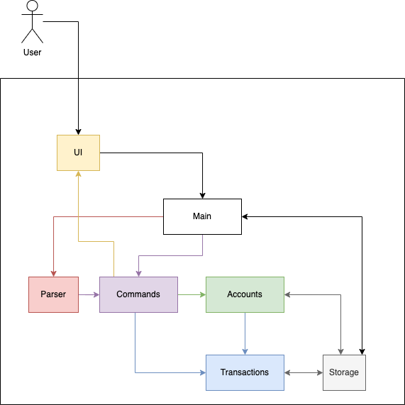
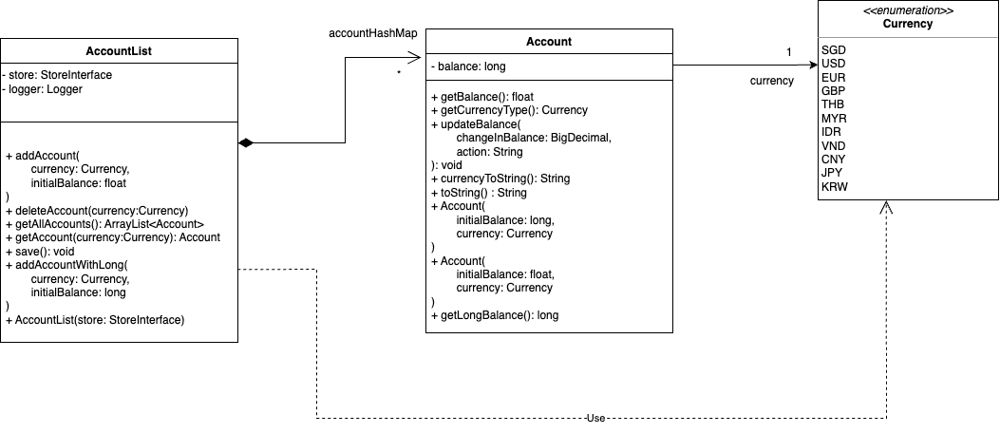
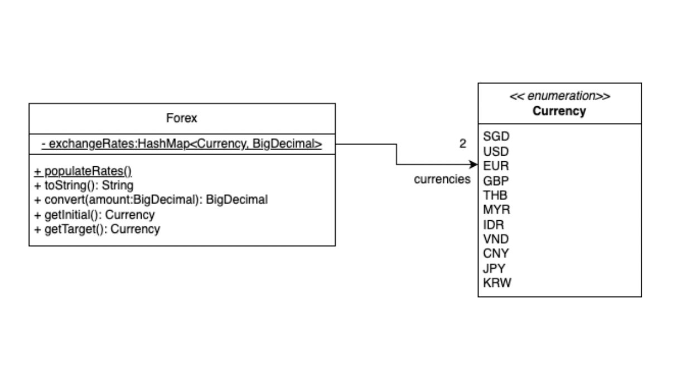
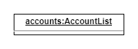
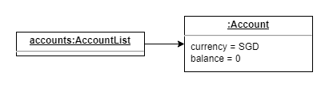
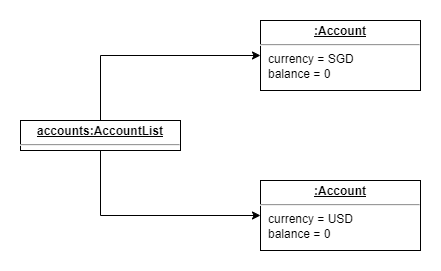
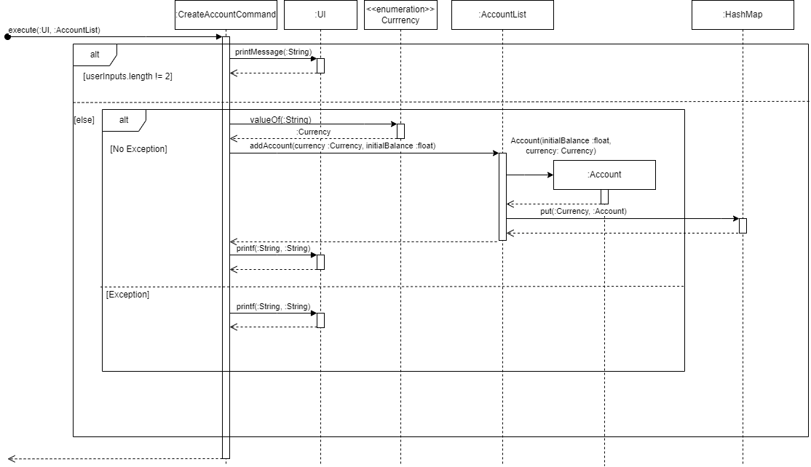

# Developer Guide

<!-- TOC -->

- [Developer Guide](#developer-guide)
  - [Acknowledgements](#acknowledgements)
  - [Setting up](#setting-up)
    - [Setting up the project in your computer](#setting-up-the-project-in-your-computer)
    - [Before writing code](#before-writing-code)
  - [Architecture](#architecture)
  - [Design](#design)
  - [Product scope](#product-scope)
    - [UI component](#ui-component)
    - [Parser component](#parser-component)
    - [Accounts Component](#accounts-component)
    - [Forex component](#forex-component)
  - [Implementation](#implementation)
    - [Create-account feature](#create-account-feature)
    - [Delete-account feature](#delete-account-feature)
    - [Add/Withdraw feature](#addwithdraw-feature)
    - [View balance feature](#view-balance-feature)
    - [Show-rate feature](#show-rate-feature)
    - [Money exchange feature](#money-exchange-feature)
  - [Appendix: Requirements](#appendix-requirements)
    - [Product scope](#product-scope-1)
    - [Target user profile](#target-user-profile)
    - [Value proposition](#value-proposition)
    - [User Stories](#user-stories)
    - [Non-Functional Requirements](#non-functional-requirements)
    - [Glossary](#glossary)
  - [Appendix: Instructions for manual testing](#appendix-instructions-for-manual-testing)

<!-- TOC -->

## Acknowledgements

{list here sources of all reused/adapted ideas, code, documentation, and third-party libraries -- include links to the
original source as well}

## Setting up

### Setting up the project in your computer

First, **fork** this repo, and **clone** the fork into your computer.

If you plan to use Intellij IDEA (highly recommended):

1. **Configure the JDK**: Follow the guide [_[se-edu/guides] IDEA: Configuring the
   JDK_](https://se-education.org/guides/tutorials/intellijJdk.html) to to ensure Intellij is configured to use **JDK 11
   **.
2. **Import the project as a Gradle project**: Follow the guide [_[se-edu/guides] IDEA: Importing a Gradle
   project_](https://se-education.org/guides/tutorials/intellijImportGradleProject.html) to import the project into
   IDEA. 
   :exclamation: Note: Importing a Gradle project is slightly different from importing a normal Java project.
3. **Verify the setup**:
    1. Run the `seedu.duke.Duke` and try a few commands.
    2. Run the tests using `./gradlew check` to ensure they all pass.

---

### Before writing code

1. **Configure the coding style**

    If using IDEA, you can use the following steps to import the code style settings.

    1. Go to `File → Settings → Editor → Code Style`
    2. Click the Gear Icon next to the `Scheme` box and then click `Import Scheme → IntelliJ IDEA code style XML`.
    3. Select the `DefaultCodeStyle.xml` file in the root of the project directory.

2. **Set up CI**

    This project comes with a GitHub Actions config files (in `.github/workflows` folder). When GitHub detects those
    files, it will run the CI for your project automatically at each push to the `master` branch or to any PR. No set up
    required.

3. **Learn the design**

When you are ready to start coding, we recommend that you get some sense of the overall design by reading
about [MoneyMoover’s architecture](DeveloperGuide.md#architecture).

## Architecture

## Design

## Product scope

### UI component

The API of this component is specified in the `Ui.java`.

The UI class deals with the user interaction with the application, which includes the printing and the logic to read in
inputs. We will pass in the instance of UI into the `execute` method of the `Command` class. The main features includes:

1. Printing text such as new line, spacer, farewell message, greeting message.

2. Empowers the users to print customised message in `printf` and `printMessage` method.

3. Reads in the user input as `String`.

### Parser component

### Accounts Component

Here is a class diagram of the Accounts component

The `Accounts` Component

-   Stores the `AccountList` which contains all the user's accounts
-   `AccountList` handles all logic dealing with accounts
-   `Account` stores both its currency type and its balance
-   There can be only one `Currency` per `Account`
-   There can be only one `Account` of each `Currency`

### Forex component

Here is a class diagram of the Forex component

The `Forex` Component

-   Stores the exchange rates of 1 SGD to all supported currencies in a hash map
-   Each `Forex` object represents the relationship between two currencies
-   `convert` can be called on a `Forex` object to convert an amount using the relationship
-   Each `Forex` object has an initial and target `Currency`
-   There is only one instance of the `exchangeRates` hash map.

The `Currency` Enum

-   Keeps all currency types supported by the exchange
-   Exchange rates are manually pulled from https://www.xe.com/currencyconverter/convert
-   Each `Forex` instance must have two `Currency` associated with it

## Implementation

### Create-account feature

The create account feature is facilitated by `AccountList` Class within the `Accounts` Component  
The method called from `AccountList` is the `addAccount` method which creates a new `Account` object  
The current implementation initialises the `Account` with 0 balance

Given below is an example of the usage of the Create Account feature and the mechanism at each step

Step 1: The user launches the application for the first time and `AccountList` is created with no `Account`

Step 2: The user passes in the command `create-account <CURRENCY>`, where `CURRENCY` is a valid string representing one
of the elements of the `Currency` enum

Step 3: The user passes in the command `create-account <CURRENCY>`, where `CURRENCY` is also valid but different to that
in step 1.

The following sequence diagram shows how the Create Account operation works

### Delete-account feature

### Add/Withdraw feature

### View balance feature

The view balance feature is facilitated using `Account` instances stored within the `AccountList` object. The main functionality is to view the balance of a specific currency if the currency is specified, else view all the currencies in the account.

### Show-rate feature

### Money exchange feature

The exchange feature is facilitated using `Account` instances stored within an `AccountList`
object. The main functionality is facilitated by the `convert` function within the `Forex`
component. The current implementation reads manual exchange rates from an online source. Future
implementation will use an API to maintain up-to-date exchange rates.

Exchange rate soure: https://www.xe.com/currencyconverter/convert

This command is executed under the assumption that an `Account` for both the initial and target
currencies exist. To avoid redundancy, please see the `create-account` feature in the developer
guide for more specific steps on how `Accounts` are created.

The exchange command executes as follows:

-   Initial and target currencies are parsed from the user input
-   A Forex object is created using the parsed currencies (see `Forex` component for more information)
-   The amount to be exchanged is parsed from the user input
-   The `Accounts` for both currencies are retrieveed
-   The converted value is calculated using the `Forex` object
-   The value of the initial `Account` is updated
-   The value of the target `Account` is updated
-   The new balances are printed

The following sequence diagram shows how the Exchange command works

## Appendix: Requirements

### Product scope

### Target user profile

-   Students who are planning to travel overseas
-   People who need to exchange money for travel
-   People who are comfortable using a CLI

### Value proposition

MoneyMoover is a **CLI application for managing and transferring international currencies**, optimized for use via a
Command Line Interface (CLI) while still having the features of other money management applications.

### User Stories

| Version | As a ... | I want to ...             | So that I can ...                                           |
| ------- | -------- | ------------------------- | ----------------------------------------------------------- |
| v1.0    | new user | see usage instructions    | refer to them when I forget how to use the application      |
| v2.0    | user     | find a to-do item by name | locate a to-do without having to go through the entire list |

### Non-Functional Requirements

{Give non-functional requirements}

### Glossary

-   _glossary item_ - Definition

## Appendix: Instructions for manual testing

{Give instructions on how to do a manual product testing e.g., how to load sample data to be used for testing}
