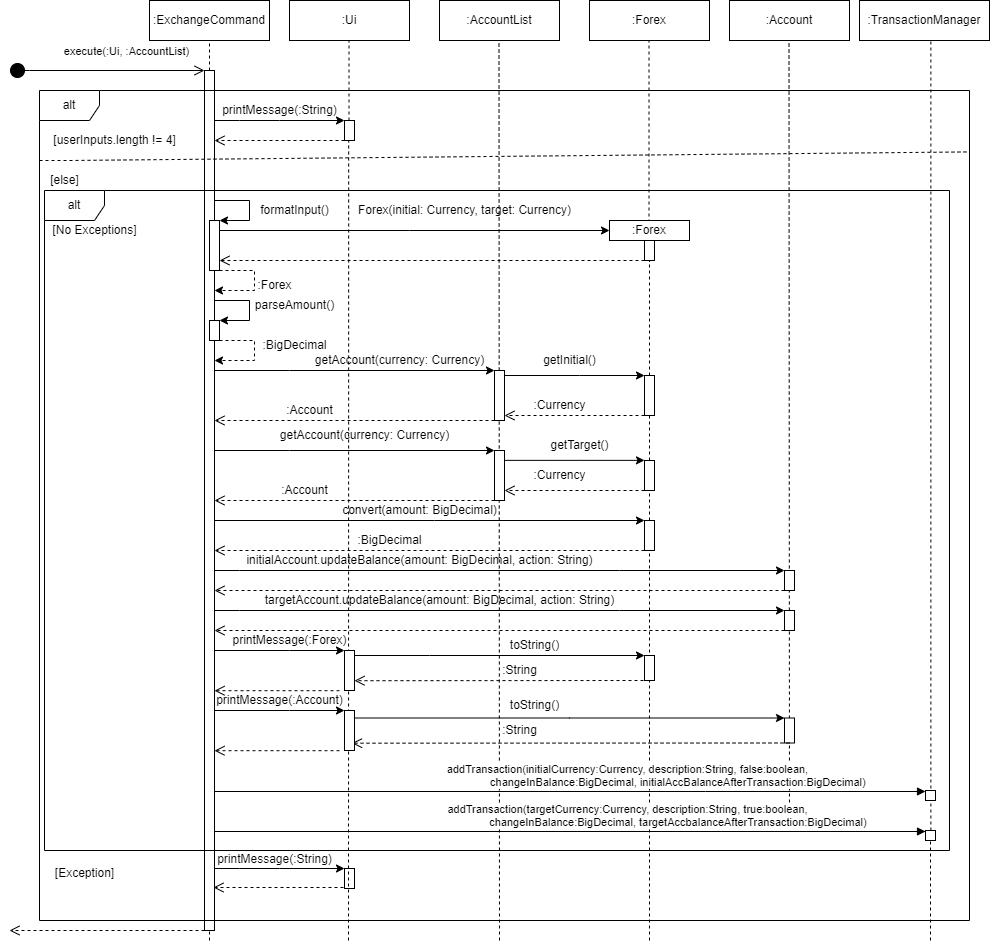
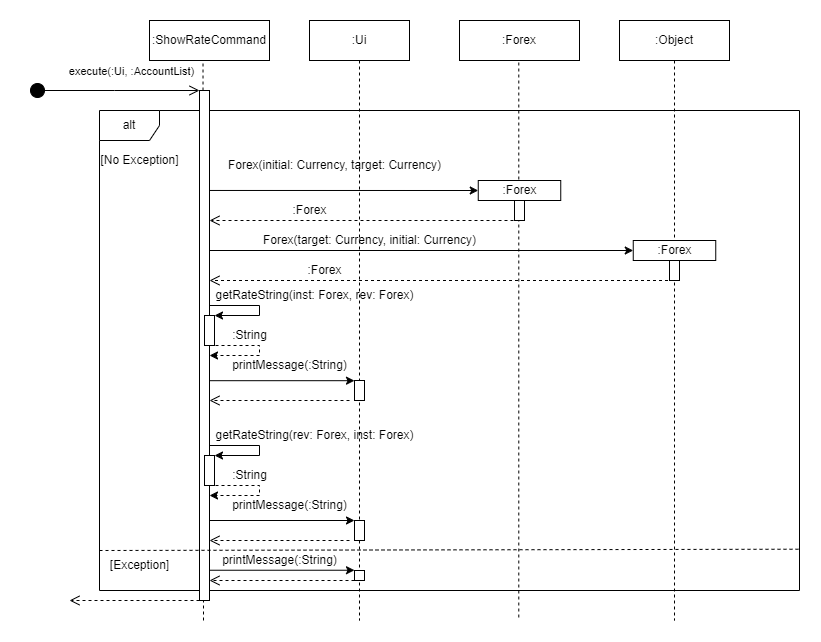
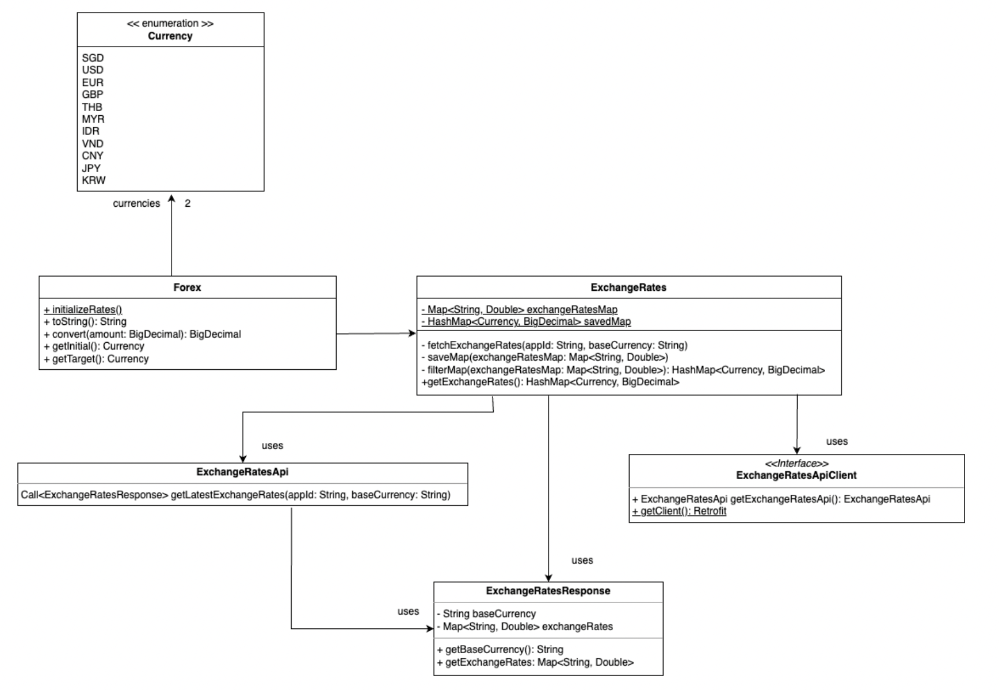

# Jacob Stein - Project Portfolio Page

## Overview - MoneyMoover

MoneyMoover is a Java CLI application for travelers to exchange between international currencies. MoneyMoover supports conversion for currencies across Asia, and pulls live exchange rates from the Internet using an API. MoneyMoover also helps track expenses and income, to ensure travelers stay within their budget.

### Summary of Contributions

Given below are my contributions to the project:

- **Code Contributed:** [RepoSense Link](https://nus-cs2113-ay2223s2.github.io/tp-dashboard/?search=&sort=groupTitle&sortWithin=title&timeframe=commit&mergegroup=&groupSelect=groupByRepos&breakdown=true&checkedFileTypes=docs~functional-code~test-code~other&since=2023-02-17&tabOpen=true&tabType=authorship&tabAuthor=jacob-stein1&tabRepo=AY2223S2-CS2113-T13-1%2Ftp%5Bmaster%5D&authorshipIsMergeGroup=false&authorshipFileTypes=docs~functional-code~test-code~other&authorshipIsBinaryFileTypeChecked=false&authorshipIsIgnoredFilesChecked=false)

- **New Feature:** Forex objects to represent currency relationships [#34](https://github.com/AY2223S2-CS2113-T13-1/tp/pull/34)

  - What it does: Represents a relationship between two currencies on the platform.
  - Justification: Forex objects are a core feature of MoneyMoover because they are the backbone of two key feature: exchanging and displaying exchange rates. Forex objects represent the relationship between two currencies
  - Highlights: Used a single currency as an intermediary for conversions so that we would not need to store a 2D data structure of exchange rates.

- **New Feature:** Exchange money between currencies [#34](https://github.com/AY2223S2-CS2113-T13-1/tp/pull/34)

  - What it does: Move money between currency accounts according to live exchange rates
  - Justification: Exchanging money between currencies is the cornerstone of MoneyMoover. Exchanging with live rates is the purpose of our application, and what makes it useful to our users.
  - Highlights: The exchange command makes use of Forex objects, which are used to represent the relationship between currencies.

- **New Feature:** Display exchange rates between currencies [#39](https://github.com/AY2223S2-CS2113-T13-1/tp/pull/39)

  - What it does: Displays the exchange rate between two currencies.
  - Justification: Prior to moving money between accounts, the user may want a preview of what the exchange rates are.
  - Highlights: By default, this command will show the exchange rate of 1:X going both ways. The user can instead input a value if they want to see what a transaction might look like before its performed

- **Enhancement to Existing Features:** Open Exchange Rates API [#83](https://github.com/AY2223S2-CS2113-T13-1/tp/pull/83)

  - Previously, exchange rates stored in the Forex class were manually entered from a [source online](https://www.xe.com/currencyconverter/convert)
  - Used Retrofit HTTP client and Open Exchange Rates API to fetch live exchange rates from the Internet
  - [Retrofit Documentation](https://square.github.io/retrofit/)
  - [Open Exchange Rates Documentation](https://docs.openexchangerates.org/reference/latest-json)
  - Created classes for API client, API response, and fetched Exchange Rates
  - Live exchange rates are now used, with old ones used in the event of no internet connection

- **Team**

  - Substantive PRs reviewed: [#188](https://github.com/AY2223S2-CS2113-T13-1/tp/pull/188#pullrequestreview-1371214455) [#181](https://github.com/AY2223S2-CS2113-T13-1/tp/pull/181#pullrequestreview-1371268587)
  - Bug reporting: [#66](https://github.com/AY2223S2-CS2113-T13-1/tp/issues/66) [#68](https://github.com/AY2223S2-CS2113-T13-1/tp/issues/68) [#189](https://github.com/AY2223S2-CS2113-T13-1/tp/issues/189)

- **Contributions to UG**

  - Wrote UG docs with examples for exchange command [#97](https://github.com/AY2223S2-CS2113-T13-1/tp/pull/97)
  - Wrote UG docs with examples for show-rate command [#97](https://github.com/AY2223S2-CS2113-T13-1/tp/pull/97)

- **Contributions to DG**
  - Wrote Forex class DG docs with class diagram [#74](https://github.com/AY2223S2-CS2113-T13-1/tp/pull/74)
  - Wrote exchange command explanation with sequence diagram [#75](https://github.com/AY2223S2-CS2113-T13-1/tp/pull/75)
  - Wrote show-rate command explanation with sequence diagram [#79](https://github.com/AY2223S2-CS2113-T13-1/tp/pull/79)
  - API class diagram and explanation [#83](https://github.com/AY2223S2-CS2113-T13-1/tp/pull/83)

### User Guide Extracts

**Exchange Command UG Documentation**

Both an 'initial' and 'target' currency must be specified. The value provided will be subtracted from the balance of
the 'initial' currency, and exchanged into the 'target currency', and will be added
to the account of the target currency. You must have accounts for both the initial and target currency to perform this
command.

Format: `exchange <initialCurrency> <targetCurrency> <amount>`

Examples of usage (assuming accounts are created) :

```text
>> exchange SGD USD 100
// S$100 will be moved from your $SGD account, transferred into $USD, then added to your $USD account

>> exchange THB MYR 5000
// ฿5000 will be moved from your ฿THB account, transferred into $MYR, then added to your $MYR account
```

Examples of error messages:

```text
>>> exchange THB SGD
>>> Please structure your exchange as 'exchange STARTING_CURRENCY TARGET_CURRENCY AMOUNT_IN_STARTING'

>>> exchange THB SGD 5000
>>> Please ensure you have enough money in your starting currency account to perform this transaction

>>> exchange THB SGD -10
>>> Please enter a valid number to exchange
```

### Developer Guide Extracts

**Exchange Command Sequence Diagram**



**Show Rate Command Sequence Diagram**



**API Class Diagram**


