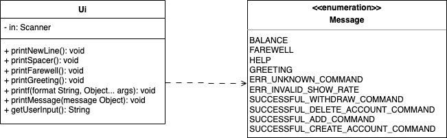
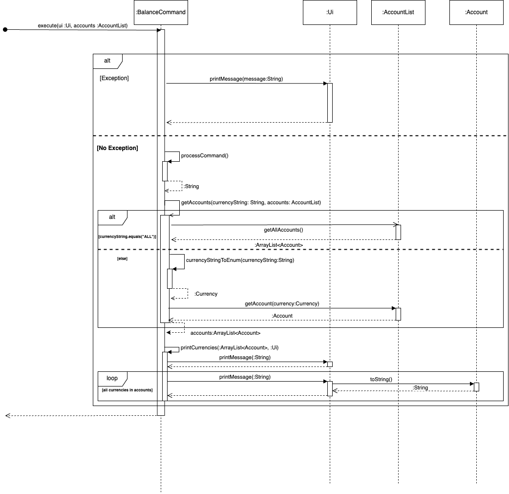

# Wen Jun Personal Portfolio Page

## 1. Overview

MoneyMoover is a **CLI application for managing and transferring international currencies**, optimized for use via a Command Line Interface (CLI) while still having the features of other money management applications. Our app will help students to **track their expenses and income** in order to stay within their budgets, so that they have enough money to travel. It will also help them convert to foreign currencies so they can see how much they have to spend overseas.

## 2. Code Contributed

Code Contributed: [RepoSense Link](https://nus-cs2113-ay2223s2.github.io/tp-dashboard/?search=woowenjun99&sort=groupTitle&sortWithin=title&timeframe=commit&mergegroup=&groupSelect=groupByRepos&breakdown=true&checkedFileTypes=docs~functional-code~test-code~other&since=2023-02-17)

## 3. Enhancements Implemented

### 3.1. UI Class

I am in charge of implementing the `Ui Class` which is used to mainly handle the User Interface aspect of the application, including reading the input, printing message and printing formatted string.

#### 3.1.1. Motivation

1. Instead of letting users to call `System.out.println`, `System.out.printf` or `in.nextLine()` directly, all developers in the team are expected to use the UI class. We have a `printFarewell()` and `printGreeting()` method which is to print the corresponding messages.

2. Another reason why we need the UI class is for abstraction. For instance, in one of the PED issue, a user tries to break the code by inserting a lot of spaces. The `getUserInput()` method helps to remove these unnecessary spaces so that the command given can be properly parsed by the commands.

### 3.2. Balance Command

I am responsible for writing the `BalanceCommand` class that extends the abstract `Command` class. This class is used to show the balance in a specific account if specified, or all the accounts.

### 3.3. Add Command

I am in charge of writing the `AddCommand` class for the project. This class is mainly used to empower the users to add funds into the account based on the specified currency and the account if any.

### 3.4. Validator Class

I am in charge of writing a class that is used to validate the amount that is read in by the user.

#### 3.4.1. Motivation

Unlike the `AddCommand` and `BalanceCommand` in 3.2 and 3.3., the `Validator` class is an important utility class that is used to validate the amount provided by the user.

The `validateAmount()` method takes in a string and determines if the amount contains any alphabetical character in it or lies outside the range of 0 to 10 million dollars. If it does, an error will be thrown. Otherwise, we will return the corresponding `BigDecimal` value.

This class is important as it helps to prevent many errors, such as reading in more than 2 decimal places which should not be possible or using a very huge number that might cause overflow, of which are commonly raised as issues during the PED.

### Contributions to the UG

In terms of the UG, I am responsible for writing the `AddCommand` and `BalanceCommand` aspect of the UG.

### Contributions to the DG

I contributed to the DG by adding the UI Class and added in the UML diagram.

I have also contributed to the DG by adding in the documentation for the BalanceCommand, and coming up with a sequence diagram for it.

### Contribution to team based task

1. I set up the GitHub organisation for my team.
2. I helped to maintain the GitHub issues for our team.
3. I helped to install GSON to be used as a storage for our project.

### Review/mentoring contributions

#### Pull Request Reviewed

1. [PR 27](https://github.com/AY2223S2-CS2113-T13-1/tp/pull/27)
2. [PR 28](https://github.com/AY2223S2-CS2113-T13-1/tp/pull/28)
3. [PR 37](https://github.com/AY2223S2-CS2113-T13-1/tp/pull/37)
4. [PR 38](https://github.com/AY2223S2-CS2113-T13-1/tp/pull/38)
5. [PR 50](https://github.com/AY2223S2-CS2113-T13-1/tp/pull/50)
6. [PR 83](https://github.com/AY2223S2-CS2113-T13-1/tp/pull/83)
7. [PR 183](https://github.com/AY2223S2-CS2113-T13-1/tp/pull/183)

### Contributions beyond the project team

#### Suggestions for other teams

[Meal360](https://github.com/nus-cs2113-AY2223S2/tp/pull/44)
[Clanki](https://github.com/nus-cs2113-AY2223S2/tp/pull/36)
[MyLedger](https://github.com/woowenjun99/ped)

#### Forum Questions Answered

1. [Issue 16](https://github.com/nus-cs2113-AY2223S2/forum/issues/16#issuecomment-1407394745)
2. [Issue 21](https://github.com/nus-cs2113-AY2223S2/forum/issues/21#issuecomment-1413058531)
3. [Issue 34](https://github.com/nus-cs2113-AY2223S2/forum/issues/34#issuecomment-1463500291)
4. [Issue 36](https://github.com/nus-cs2113-AY2223S2/forum/issues/36#issuecomment-1465348359)
